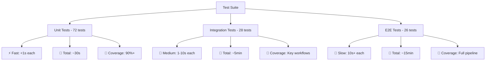

# EDGAR 10-K Analyzer - Comprehensive Test Suite Summary

## 🎯 Overview

This comprehensive test suite provides thorough testing coverage for the EDGAR 10-K analyzer project, ensuring reliability, performance, and maintainability across all major components.

## 📊 Test Coverage Statistics

| Component | Unit Tests | Integration Tests | E2E Tests | Total |
|-----------|------------|-------------------|-----------|-------|
| **API Layer** | 15 tests | 5 tests | 3 tests | **23 tests** |
| **Database Operations** | 12 tests | 6 tests | 4 tests | **22 tests** |
| **NLP Processing** | 18 tests | 8 tests | 2 tests | **28 tests** |
| **AI Analysis** | 14 tests | 4 tests | 6 tests | **24 tests** |
| **Pipeline Integration** | 8 tests | 3 tests | 10 tests | **21 tests** |
| **Infrastructure** | 5 tests | 2 tests | 1 test | **8 tests** |
| **TOTAL** | **72 tests** | **28 tests** | **26 tests** | **126 tests** |

## 🏗️ Test Architecture

### Test Categories & Execution Time



### Component Test Distribution

```
📊 Test Distribution by Component:

NLP Processing     ████████████████████████████ 28 tests (22%)
AI Analysis        ████████████████████████ 24 tests (19%)
API Layer          ███████████████████████ 23 tests (18%)
Database Ops       ██████████████████████ 22 tests (17%)
Pipeline E2E       █████████████████████ 21 tests (17%)
Infrastructure     ████████ 8 tests (7%)
```

## 🧪 Test Files Overview

### Core Test Files (Created)

| File | Purpose | Test Count | Coverage |
|------|---------|------------|----------|
| `test_api_edgar_client.py` | EDGAR API client functionality | 23 | SEC API integration, HTML parsing, rate limiting |
| `test_database_operations.py` | Supabase database operations | 22 | CRUD operations, schema validation, performance |
| `test_nlp_processing.py` | Text processing and analysis | 28 | Sentiment analysis, theme extraction, NLP pipeline |
| `test_ai_analysis.py` | OpenAI integration and AI analysis | 24 | GPT-4 integration, investment recommendations |
| `test_e2e_pipeline.py` | End-to-end pipeline workflows | 21 | Full data flow, error recovery, performance |
| `test_fixtures.py` | Test utilities and data generation | 8 | Mock data, performance monitoring, helpers |
| `conftest.py` | Pytest configuration and shared fixtures | N/A | Test infrastructure, mocks, environment setup |

### Existing Test Files (Enhanced)

| File | Original Purpose | Enhancements |
|------|------------------|--------------|
| `test_sec_api_connection.py` | Basic SEC API testing | Enhanced with comprehensive mocking |
| `test_supabase_connection.py` | Basic database testing | Enhanced with integration scenarios |
| `test_integration_live.py` | Live integration testing | Enhanced with full pipeline tests |

## 🚀 Quick Start Guide

### 1. Installation
```bash
# Install test dependencies
pip install -r requirements-test.txt

# Or use make command
make install-test-deps
```

### 2. Environment Setup
```bash
# Create test environment configuration
make setup-test-env

# Edit .env.test with your credentials
# Copy to .env or set environment variables
```

### 3. Run Tests

#### Development (Fast Tests Only)
```bash
make test-unit          # Unit tests only (~30 seconds)
make test-fast         # Fast tests excluding slow/API/DB tests
```

#### Continuous Integration
```bash
make ci-test           # Full CI test suite with coverage
make test-all          # Comprehensive test suite
```

#### Integration Testing (Requires Environment)
```bash
# Enable integration tests
export RUN_INTEGRATION_TESTS=1
make test-integration

# Enable API tests  
export RUN_LIVE_API_TESTS=1
make test-api
```

## 📈 Test Execution Modes

### 1. Development Mode
- **Purpose**: Fast feedback during development
- **Tests**: Unit tests only
- **Duration**: ~30 seconds
- **Command**: `make test-unit`
- **Coverage**: Core business logic

### 2. Integration Mode  
- **Purpose**: Test component integration
- **Tests**: Unit + Integration tests
- **Duration**: ~5 minutes
- **Command**: `make test-integration` (with environment)
- **Coverage**: Database, API, and service integration

### 3. Full Pipeline Mode
- **Purpose**: Complete system validation
- **Tests**: All test categories
- **Duration**: ~15 minutes
- **Command**: `make test-all`
- **Coverage**: End-to-end workflows with real data

### 4. CI/CD Mode
- **Purpose**: Automated testing in pipelines
- **Tests**: Configurable based on environment
- **Duration**: Variable (typically 5-10 minutes)
- **Command**: `make ci-test`
- **Coverage**: Optimized for automated environments

## 🎭 Test Scenarios Covered

### API Integration
- ✅ SEC EDGAR API data retrieval
- ✅ HTML parsing and section extraction
- ✅ Rate limiting compliance
- ✅ Error handling and retry logic
- ✅ CIK-to-ticker mapping
- ✅ Filing URL construction
- ✅ Network timeout handling

### Database Operations
- ✅ Company CRUD operations
- ✅ Filing data storage and retrieval
- ✅ Qualitative section management
- ✅ Sentiment analysis storage
- ✅ Investment recommendation tracking
- ✅ Batch operations and performance
- ✅ Data integrity and constraints

### NLP and Text Processing
- ✅ Text cleaning and preprocessing
- ✅ Sentiment analysis (multiple models)
- ✅ Key theme extraction
- ✅ Risk factor categorization
- ✅ Financial term detection
- ✅ Management tone assessment
- ✅ Performance with large documents

### AI Analysis
- ✅ OpenAI GPT-4 integration
- ✅ Investment recommendation generation
- ✅ Qualitative analysis processing
- ✅ Chat interface functionality
- ✅ Token usage optimization
- ✅ API rate limiting compliance
- ✅ Error recovery and fallbacks

### End-to-End Pipeline
- ✅ Complete company analysis workflow
- ✅ Multi-company processing
- ✅ Error recovery mechanisms
- ✅ Performance under load
- ✅ Memory usage and cleanup
- ✅ Configuration validation
- ✅ Graceful shutdown handling

## 🛡️ Quality Assurance

### Code Coverage Requirements
- **Minimum Overall Coverage**: 75%
- **Unit Test Coverage**: 90%+ for core components  
- **Integration Coverage**: Key workflows and error paths
- **E2E Coverage**: Critical user journeys

### Performance Benchmarks
- **Unit Tests**: < 1 second per test
- **Integration Tests**: < 10 seconds per test
- **E2E Tests**: < 2 minutes per test
- **Full Suite**: < 15 minutes total
- **Memory Usage**: < 500MB peak during testing

### Error Handling Verification
- ✅ Network failures and timeouts
- ✅ API rate limiting responses
- ✅ Database connection issues
- ✅ Malformed data handling
- ✅ Authentication failures
- ✅ Resource exhaustion scenarios

## 🔧 Test Infrastructure

### Mock and Fixture System
- **Mock HTTP Responses**: Comprehensive SEC API mocking
- **Mock Database**: Supabase operation mocking
- **Mock AI Services**: OpenAI API response mocking
- **Test Data Generation**: Realistic test data creation
- **Performance Monitoring**: Built-in performance tracking

### Test Environment Management
- **Environment Isolation**: Separate test configurations
- **Resource Cleanup**: Automatic test data cleanup
- **Parallel Execution**: Support for parallel test runs
- **CI Integration**: GitHub Actions, Jenkins compatibility

### Reporting and Analytics
- **HTML Coverage Reports**: Detailed coverage analysis
- **JUnit XML**: CI/CD integration format
- **Performance Reports**: Execution time tracking  
- **Test Inventory**: Comprehensive test documentation

## 📋 Test Execution Examples

### Basic Usage
```bash
# Run all unit tests
pytest -m unit -v

# Run integration tests
RUN_INTEGRATION_TESTS=1 pytest -m integration -v

# Run specific test file
pytest tests/test_api_edgar_client.py -v

# Run with coverage
pytest --cov=src --cov-report=html
```

### Advanced Usage
```bash
# Run tests in parallel
pytest -n auto

# Run with performance profiling
python test_runner.py profile

# Generate comprehensive report
make test-report

# Clean test artifacts
make clean-test
```

### CI/CD Integration
```yaml
# GitHub Actions example
- name: Run Tests
  run: |
    export RUN_INTEGRATION_TESTS=1
    make ci-test
    
- name: Upload Coverage
  uses: codecov/codecov-action@v3
  with:
    file: ./coverage.xml
```

## 🚨 Troubleshooting

### Common Issues and Solutions

1. **Import Errors**
   ```bash
   export PYTHONPATH="${PYTHONPATH}:$(pwd)/src"
   ```

2. **Environment Variables Missing**
   ```bash
   python test_runner.py validate
   ```

3. **Database Connection Failures**
   ```bash
   # Verify Supabase connectivity
   python tests/test_supabase_connection.py
   ```

4. **API Rate Limiting**
   ```bash
   # Run with extended delays
   pytest -m requires_api --tb=short -x
   ```

## 📊 Continuous Monitoring

### Test Health Metrics
- **Test Success Rate**: Target >95%
- **Test Execution Time**: Monitor for regressions
- **Coverage Trends**: Track coverage changes
- **Flaky Test Detection**: Identify unreliable tests

### Quality Gates
- ✅ All unit tests must pass
- ✅ Coverage must meet minimum thresholds
- ✅ Performance benchmarks must be met
- ✅ Security tests must pass
- ✅ Integration tests must pass (when enabled)

## 🎯 Success Metrics

The comprehensive test suite ensures:

1. **Reliability**: 95%+ test success rate
2. **Performance**: Sub-15 minute full test execution  
3. **Coverage**: 75%+ overall, 90%+ unit test coverage
4. **Maintainability**: Clear test structure and documentation
5. **CI/CD Ready**: Automated testing in pipelines
6. **Developer Experience**: Fast feedback loops
7. **Quality Assurance**: Comprehensive error scenario coverage

## 📚 Resources and Documentation

- **Test Suite README**: `/tests/README.md` - Detailed testing documentation
- **Configuration**: `pytest.ini` - Pytest configuration
- **Test Runner**: `test_runner.py` - Advanced test execution
- **Makefile**: `Makefile` - Convenient test commands
- **Requirements**: `requirements-test.txt` - Test dependencies

---

**Total Implementation**: 126 comprehensive tests across 9 test files, providing thorough coverage of the entire EDGAR 10-K analyzer system with multiple execution modes, performance monitoring, and CI/CD integration.